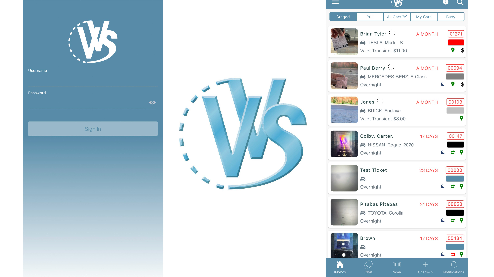

# Virtual Valet Systems (VVS) Mobile App



## Table of Contents

-   [Introduction](#introduction)
-   [Environment setup](#environment-setup)
-   [How to use the application](#how-to-use-application)
-   [Additional resources](#additional-resources)

## Introduction

Tailored for employees, this app enables valet attendants to create valet tickets, send e-claim tickets to customers, process payments, view customer-initiated car requests, and more. Customers are checked into the system via the VVS Mobile app, where attendants gather necessary information to create a ticket. Customers receive a text message containing ticket details, can pay for the valet service, and request their vehicle. Valets can update ticket status, edit information, and process payments, with all activity tracked in real-time within both the mobile application and [admin page](https://gitlab.com/soliteksolutions/command-center-ui).

## How to use application

Once you have set up the property from the VVS Admin, employees will have access to use the VVS Mobile app. For instructions on how to set up on VVS Admin click [here](https://gitlab.com/soliteksolutions/command-center-ui).

-   Log into the application
-   Choose a property from the list when you are prompted.
-   From here, you will be taken to the main page, and the keybox which houses all of the current ticket information.
-   For step by step instructions on how to use the mobile app, including life cycle of the vehicle and how to check cards in and out, please visit the [full documentation here](https://docs.google.com/document/d/1s9Cjga-z2ViJQCjJgm6NN_NaEx7ZXtqIYnx5OcLzFBM/edit).

## Environment setup

### For Mac OS

You will need to have the following installed on your machine:

-   [Node (version 14) and npm](https://nodejs.org/en/download/package-manager)
    -   To switch between node versions install `nvm`
-   Python
-   Angular CLI (recommended to install globally)
    ```
    npm install -g @angular/cli
    (npm install -g @ionic/cli@6 for compatibilty w/ Nodejs v14.21.3)
    ```
-   Ionic CLI (recommended to install globally)
    ```
    npm install -g @ionic/cli
    ```
-   To open the application via Docker, download [Docker Desktop](https://www.docker.com/products/docker-desktop/)
-   Install packages from root folder before proceeding:

    ```
    npm install
    ```

## How to start the app (development)

### From Ionic

-   Run the command:

    ```
    npm run:start dev
    ```

-   Go to http://localhost:4400/ to view app.

### From Docker

-   Make sure there is a Dockerfile in the root folder, if no Dockerfile, see instructions on how to set up [here](https://docs.google.com/document/d/16eyD59UC3NHEWk0JBmcFrd5WrdShpBufdaC1L1HLsCw/edit)

-   Open Docker and make sure its running. Replace <app-name> with a name of your choosing.
-   Run the command:

    ```
    docker build -t <app-name> .
    ```

    ```
    docker run -p 4400:4400 <app-name>
    ```

-   Go to http://localhost:4400/ to view app.

-   Alternatively, download the app from the iOS app store. Instructions on how to open iOS app on mobile in dev mode [here](https://docs.google.com/document/d/1s9Cjga-z2ViJQCjJgm6NN_NaEx7ZXtqIYnx5OcLzFBM/edit).

## Additional resources

### YouTube Videos

-   [VVS Overview and company story](https://www.youtube.com/watch?v=jitQwu35iOo)
-   [VVS Admin and mobile app overview](https://www.youtube.com/watch?v=mFxxFt99GvY&t=6s&ab_channel=VVSValet)

### Other documentation

-   [VVS Daily workflow](https://drive.google.com/file/d/1FtKgyGyO-Vn1gHP4WIutSRIthvAEt9Ve/view#{%22pageId%22:%22DGJhmuDuo8q0qZEZlcLK%22})
    -   This chart outlines the work flow for a car parked during the day.
-   [VVS Overnight workflow](https://drive.google.com/file/d/1W2Ga7RXfXHjMV9ek_7FyULw8bXTV-Dvu/view)
    -   This chart outlines the work flow for a car parked overnight, where customers can both checkout for return or depart permanently.
